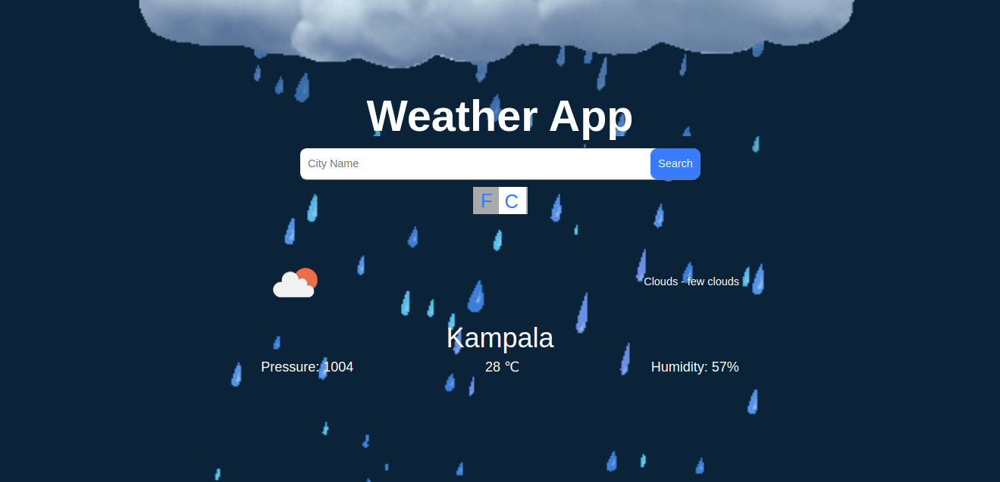

# Weather App

> Weather App using Javascript and openweathermap API. The main goal for this project was to build weather App using webpack, ES6 modules, Async, Promises, and API.
  - I have used function to fetch data from API and display it on a webpage.

> Note: I have not pushed my API key. Kindly generate your own API key from [openweathermap websit](https://openweathermap.org/) and Use it. To generate API key you will have to sign up on the [openweathermap websit](https://openweathermap.org/).

### You can access a Live Demo [HERE]()

## Built With

- Javascript
- Webpack
- HTML5
- CSS3
- Bootstrap
- openweathermap API

## Getting Started

To get a local copy up and running follow these simple steps.

- [ ] Open your terminal
- [ ]  Navigate to the directory where you will like to install the repo by running `cd FOLDER-NAME` 
- [ ] Clone this repository
 > `git clone https://github.com/Div685/Weather-App-JS.git`
- [ ] create `api.js` file inside the `src` folder.
- [ ] After define a variable called API and export it.
    `const API = 'your API Key'`
    `export default API`
 - [ ] Now run `index.html` file in your favorite browser.

 
## Authors

👤 **Divyesh Patel**

- GitHub: [@Div685](https://github.com/Div685)
- Twitter: [@div_685](https://twitter.com/div_685)
- LinkedIn: [Divyesh Patel](https://www.linkedin.com/in/divyesh-daxa-patel/)

## 🤝 Contributing

Contributions, issues, and feature requests are welcome!

Feel free to check the [issues page](https://github.com/Div685/Weather-App-JS/issues).

## Show your support

Give a ⭐️ if you like this project!